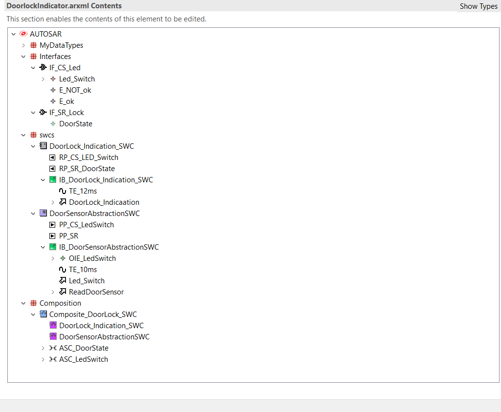

# AUTOSAR Door Lock Indication on STM32

A bare-metal implementation of an AUTOSAR-style RTE (Runtime Environment) for a Door Lock Indicator project, running on an STM32F401RCT6 microcontroller.

## Project Overview
This project isolates the application software components from the hardware using an ARUnit-generated RTE. Instead of relying on a fully compliant AUTOSAR OS, a custom 10ms bare-metal task scheduler is implemented in `main.c` to dispatch the RTE runnables.

### Software Components (SWCs):
* **SWC_DoorState (Sensor Abstraction):** Reads the raw physical state of the door switch via MCAL DIO and writes to an RTE Sender/Receiver port.
* **SWC_DoorLockIndicatorAlgo (Application SWC):** Reads the abstract door state from the RTE buffer, processes the logic, and invokes a Synchronous Client/Server call to the LED actuator.
* **SWC_LED_Actuator:** Receives the server call and translates it into MCAL DIO writes to trigger the LED.

## Hardware Setup
* **Target:** STM32F401RCT6
* **Door Sensor:** Push button connected to `PA1` (Configured with Internal Pull-Up. LOW = Door Opened, HIGH = Door Closed).
* **LED Actuator:** LED connected to `PA0` (Active-Low configuration).

## Toolchain
* STM32CubeMX & STM32CubeIDE (HAL Driver)
* ARUnit (RTE Generation)

